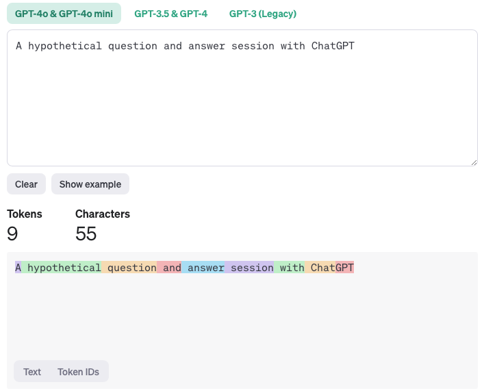
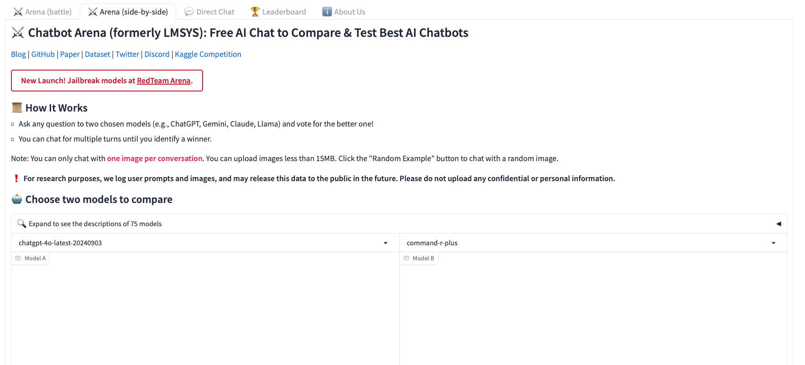
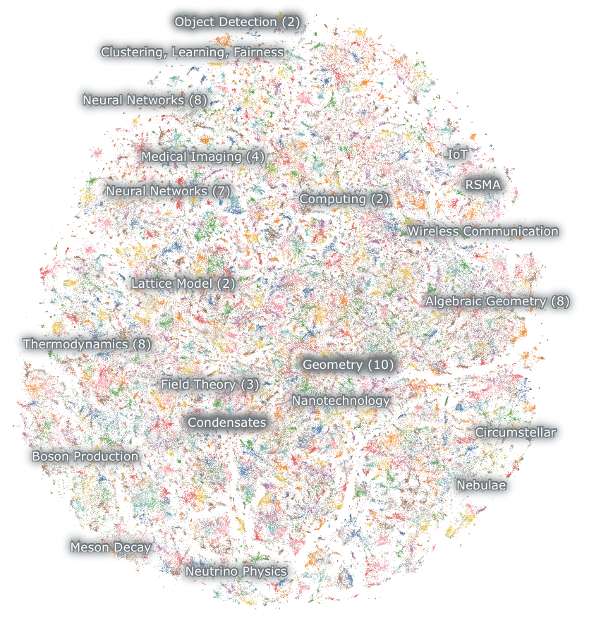
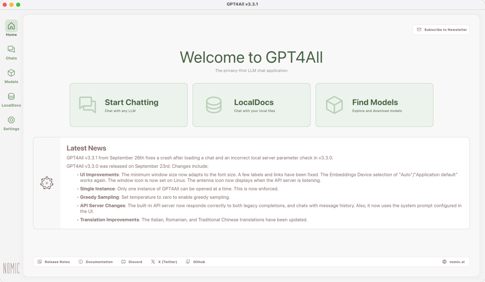
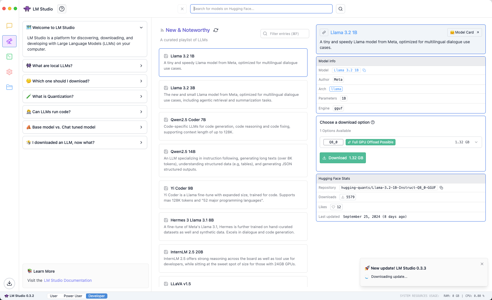
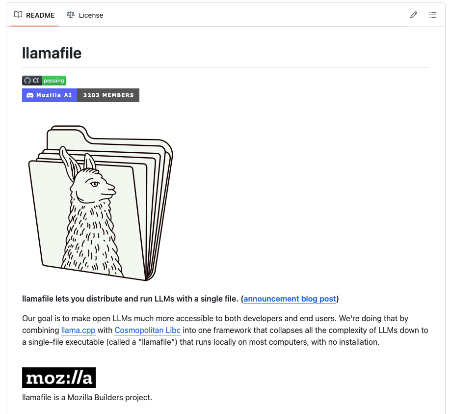
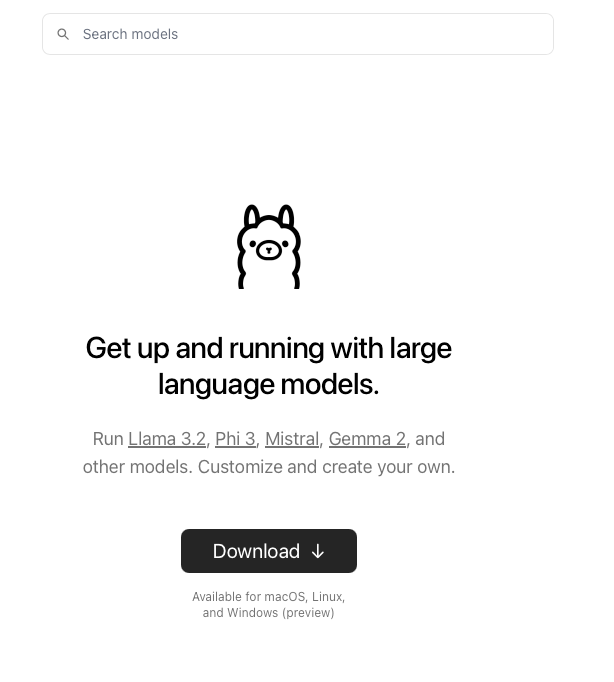

# Local Large Language Models 

* This repo is for in class activity for the course “**Deep Learning and NLP**” with a focus on Large Language Models. 
* This course teaches **OpenAI API** using Local LLM models , example: `llamafile`, `LM Studio`, `GPT4ALL`, or `Ollama` 

---

* [Showcase/Resources](#showcase)
  * [OpenAI Tokenizer](#openai-tokenizer)
  * [Chatbot Arena](#chatbot-arena)
  * [Nomic Atlas](#nomic-atlas)
* [Local LLMs](#local-llms)
  * [GPT4ALL](#gpt4all)
  * [LM Studio](#lm-studio)
  * [LLamafile](#llamafile)
  * [Ollama](#ollama)
* [LLM Leaderboards](#llm-leaderboards)

# Showcase

### OpenAI Tokenizer 

https://platform.openai.com/tokenizer

### Chatbot Arena

https://lmarena.ai

### Nomic Atlas 

https://atlas.nomic.ai/map/historical-arxiv

# Local LLMs

### GPT4ALL

https://www.nomic.ai/gpt4all

## LM Studio

https://lmstudio.ai

## LLamafile

https://github.com/Mozilla-Ocho/llamafile

## Ollama

https://ollama.com

## LLM Leaderboards

* https://artificialanalysis.ai/leaderboards/models
* https://www.vellum.ai/llm-leaderboard
* https://klu.ai/llm-leaderboard
* https://huggingface.co/spaces/open-llm-leaderboard/open_llm_leaderboard