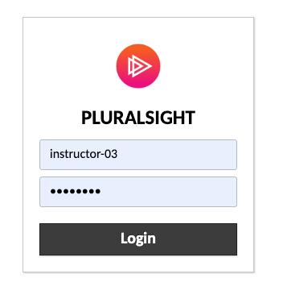
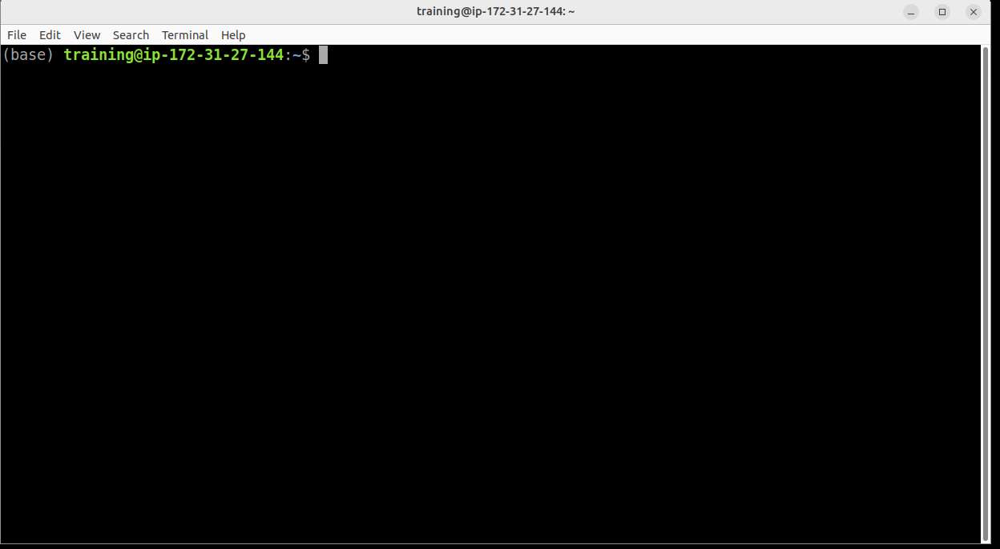
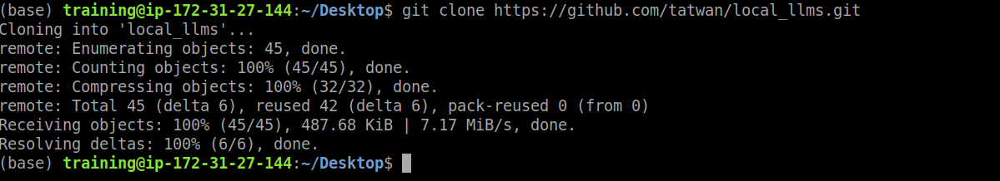
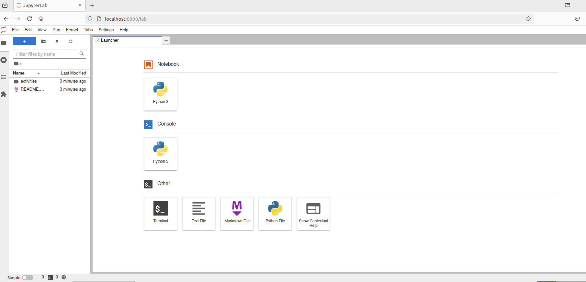
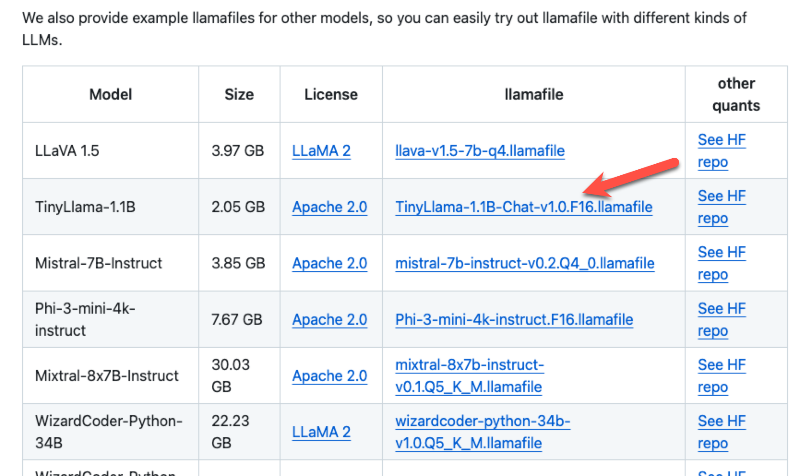
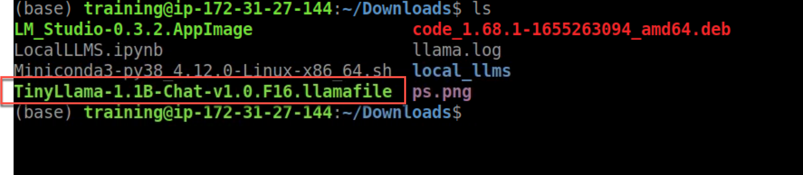
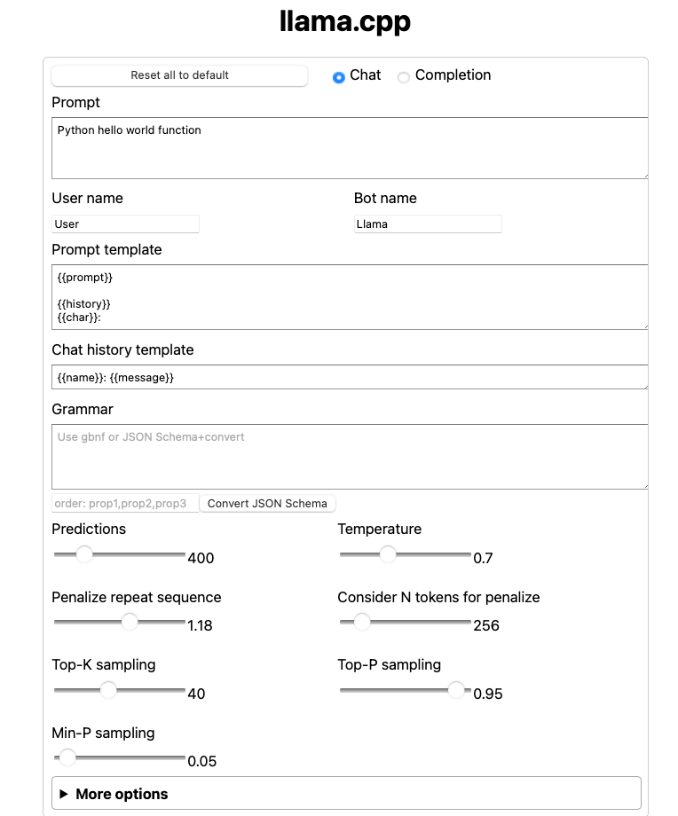

# Prerequisites and Setting things up

## Login to your Virtual Machine 

1. Go to the following URL https://training.datacouch.io/pluralsight/#/
2. Login using the information given to you in class



3. You should see a similar screen once you are logged in


## Download the GitHub Repo and Start Jupyter Lab

1. Double click on the `MATE Terminal` icon to launch a terminal



3. Navigate to Desktop 

```bash
cd Desktop/
```

4. From Desktop folder type the following to download the GitHub repo for this class

```bash
git clone https://github.com/tatwan/local_llms.git
```



5. Go to the folder

```bash
cd local_llms/
```

6. Start Jupyter Lab

```bash
jupyter lab
```


This should launch FireFox to http://localhost:8888/lab




## Download Llamfile

1. Go to the following URL using Firefox  from inside the Virtual Machine https://github.com/Mozilla-Ocho/llamafile
2. Scroll down to the **Other example llamafiles** section 



3. Click on the `TinyLlama-1.1B-Chat-v1.0.F16.llamafile` file to download inside the VM. You can select the default **Downloads** folder
4. Open a new Terminal
5. Navigate to the Downloads folder `cd Downloads/`
6. Make sure you see the file. Type `ls` and you should see the TinyLlama file similar to the following 



7. Type the following to gran permissions 

```bash
chmod +x TinyLlama-1.1B-Chat-v1.0.F16.llamafile
```

8. To start the llamafile server type 

```bash
./TinyLlama-1.1B-Chat-v1.0.F16.llamafile
```

9. In FireFox it should launch the following page on http://127.0.0.1:8080 




