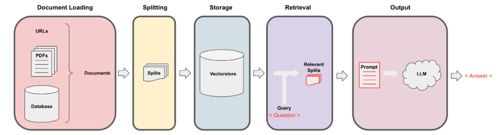
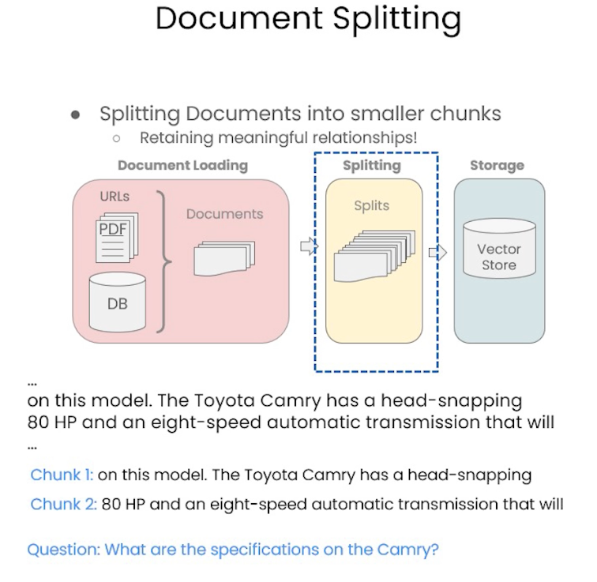
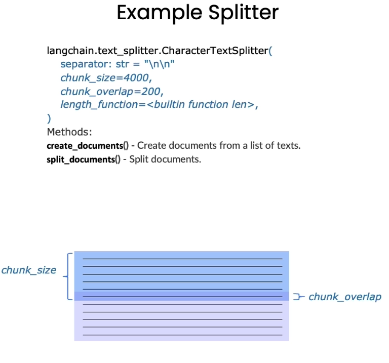
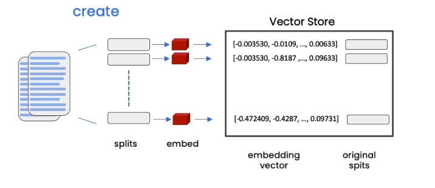
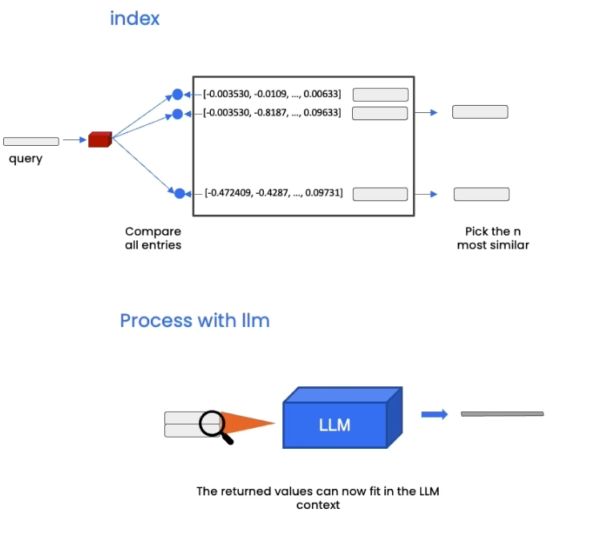

# LangChain 

### RAG

A Retrieval-Augmented Generation (RAG) application is a system that enhances the capabilities of large language models (LLMs) by integrating them with a retrieval mechanism. This approach allows the model to access and incorporate external data sources, resulting in more accurate and contextually relevant response

### Chat with your PDF

In this exercise you learn how to use LangChain, another framework for creating RAG applications. In this activity you will use LangChain to chat with a PDF file.


Load the need libraries first:


```python
#!pip install openai
#!pip install pypdf 
#!pip install --upgrade langchain langchain-community
#! pip install lark
```


```python
import langchain
langchain.__version__
```


    '0.3.4'

LangChain has an integration with llamafile. 

```python
from langchain_community.llms.llamafile import Llamafile

llm = Llamafile(temperature=0)

# test
llm.invoke("What is Generative AI?")
```

# RAG Application Flow



## Document Loaders

In LangChain, **data loaders** are specialized components designed to facilitate the loading and conversion of data from various sources into a standardized format that can be easily processed by LangChain applications. These loaders act as connectors between raw data and the LangChain framework, enabling seamless integration and interaction with diverse data sources.

Use **PyPDFLoader** to load our PDF file. It is a research paper titled “ASystematic Survey of Prompt Engineering in Large Language Models: Techniques and Applications” which you can find here https://arxiv.org/pdf/2402.07927


```python
from langchain.document_loaders import PyPDFLoader
loader = PyPDFLoader('https://arxiv.org/pdf/2402.07927')
pages = loader.load()
```


```python
len(pages)
```

Note the number of pages.

You can print the first page using

```python
pages[0].page_content
```

Or a subset of the first page


```python
pages[0].page_content[0:500]
```


    'A Systematic Survey of Prompt Engineering in Large Language Models:\nTechniques and Applications\nPranab Sahoo1,Ayush Kumar Singh1,Sriparna Saha1,Vinija Jain2,3,Samrat\nMondal1and Aman Chadha2,3\n1Department of Computer Science And Engineering, Indian Institute of Technology Patna\n2Stanford University,3Amazon AI\n{pranab_2021cs25, ayush_2211ai27, sriparna, samrat}@iitp.ac.in, hi@vinija.ai,\nhi@aman.ai\nAbstract\nPrompt engineering has emerged as an indispens-\nable technique for extending the capabilitie'
    1

You can view some metadata information such as source and page number. This is useful if you are reading multiple PDF files.


```python
pages[0].metadata
```


    {'source': 'https://arxiv.org/pdf/2402.07927', 'page': 0}


## Document Splitter

When working with large files, we need a strategy to chunk down a large file into smaller chunks. 

In LangChain, **document splitters** are tools used to divide large pieces of text into smaller, more manageable chunks. This process is essential for various applications, such as natural language processing tasks, where handling large documents in their entirety can be inefficient or impractical due to input size limitations of models.





The following using **RecursiveCharacterTextSplitter** with a `chunk_size` of 1500 characters and `chunk_overlap` of 150.


```python
from langchain.text_splitter import RecursiveCharacterTextSplitter
text_splitter = RecursiveCharacterTextSplitter(
    chunk_size = 1500,
    chunk_overlap = 150
)
```


```python
splits = text_splitter.split_documents(pages)
```


```python
len(splits)
```

Note the number of splits created. Compare this to the number of pages. You can view the content of the first split:


```python
splits[0]
```


    Document(metadata={'source': 'data/2402.07927v1.pdf', 'page': 0}, page_content='A Systematic Survey of Prompt Engineering in Large Language Models:\nTechniques and Applications\nPranab Sahoo1,Ayush Kumar Singh1,Sriparna Saha1,Vinija Jain2,3,Samrat\nMondal1and Aman Chadha2,3\n1Department of Computer Science And Engineering, Indian Institute of Technology Patna\n2Stanford University,3Amazon AI\n{pranab_2021cs25, ayush_2211ai27, sriparna, samrat}@iitp.ac.in, hi@vinija.ai,\nhi@aman.ai\nAbstract\nPrompt engineering has emerged as an indispens-\nable technique for extending the capabilities of large\nlanguage models (LLMs) and vision-language mod-\nels (VLMs). This approach leverages task-specific\ninstructions, known as prompts, to enhance model\nefficacy without modifying the core model param-\neters. Rather than updating the model parameters,\nprompts allow seamless integration of pre-trained\nmodels into downstream tasks by eliciting desired\nmodel behaviors solely based on the given prompt.\nPrompts can be natural language instructions that\nprovide context to guide the model or learned vec-\ntor representations that activate relevant knowledge.\nThis burgeoning field has enabled success across\nvarious applications, from question-answering to\ncommonsense reasoning. However, there remains a\nlack of systematic organization and understanding\nof the diverse prompt engineering methods and tech-\nniques. This survey paper addresses the gap by pro-\nviding a structured overview of recent advancements\nin prompt engineering, categorized by application')


## Embeddings


We are using the `LlamafileEmbeddings`. LangChain supports a large number of embeddings including OpenAI.


```python
from langchain_community.embeddings import LlamafileEmbeddings
embedding = LlamafileEmbeddings()
```

Let’s understand how embedding work with a quick demo:


```python
sentence1 = "i like dogs"
sentence2 = "i like canines"
sentence3 = "the weather is ugly outside"
sentence4 = "it is humid and hot"

embedding1 = embedding.embed_query(sentence1)
embedding2 = embedding.embed_query(sentence2)
embedding3 = embedding.embed_query(sentence3)
embedding4 = embedding.embed_query(sentence4)
```

Now we have 4 embedding vectors: `embedding1`, `embedding2`, `embedding3`, and `embedding4` 

Note that all of them will have the same size of 2048. This will vary by the LLM model you are using. You can check this using `len(embedding1)`

#### Cosine Similarity

Cosine similarity is a metric used to measure how similar two vectors are in an inner product space. It is particularly useful in fields like text analysis, where it can quantify the similarity between two documents represented as vectors. 

Here is an example of a function that can help us measure similarity between two vectors:


```python
import numpy as np

def cosine_similarity(vec1, vec2):
    dot_product = np.dot(vec1, vec2)
    magnitude_vec1 = np.linalg.norm(vec1)
    magnitude_vec2 = np.linalg.norm(vec2)
    similarity = dot_product / (magnitude_vec1 * magnitude_vec2)
    print(f"Cosine Similarity: {similarity}")

```

Compare the similarity between the four embedding/vectors:


```python
# example usage
cosine_similarity(embedding1, embedding2)
cosine_similarity(embedding2, embedding1)
cosine_similarity(embedding1, embedding3)
cosine_similarity(embedding3, embedding4)
```

    Cosine Similarity: 0.9245291525118511
    Cosine Similarity: 0.9245291525118511
    Cosine Similarity: 0.5671578206689843
    Cosine Similarity: 0.6760660345527668

**How do we interpret the results of Cosine Similarity**

Cosine similarity values range from -1 to 1:

- **1**: The vectors are identical in direction.
- **0**: The vectors are orthogonal (i.e., they have no similarity).
- **-1**: The vectors are diametrically opposed.

## Vector Store

A **vector store** is a specialized database designed to handle and manage **vector embeddings**, which are numerical representations of data in a multi-dimensional space. These embeddings are crucial for various AI applications, including natural language processing, image recognition, and semantic search. Vector stores like **Chroma** are optimized for storing, retrieving, and querying these high-dimensional vectors efficiently.

Chroma has gained popularity as a vector database due to ease of use, full-featured database, and being open-source. 

Chroma supports both **in-memory** and **persistent storage** modes


```python
# !pip install chromadb
```


```python
from langchain.vectorstores import Chroma
```


```python
persist_directory = 'db/chroma/'
```



The following will **persist** the storage to `db/chroma` directory. This can be useful for future retrieval so you do not have to re-create the embeddings ..etc. If you did not provide a `persist_directory` then it will be stored **in-memory.**


```python
vectordb = Chroma.from_documents(
    documents=splits,
    embedding=embedding,
    persist_directory=persist_directory
)
```


```python
print(vectordb._collection.count())
```

    40

## Similarity Search

Using a Vector Database, will automate the process of conducting similarity search and present the top **k** results. These are what we call context, that then can get passed to an LLM for final processing. 



Here are example queries using the Vector Store. Note, so far the LLM is not involved in the process, the matches are based on similarity search only. 


```python
question = "is there an email i can ask for help"
docs = vectordb.similarity_search(question,k=3)

```


```python
for page in docs:
    print(f"found in page {page.metadata['page']}")
```

    found in page 0
    found in page 3
    found in page 6

```python
docs[0].page_content
```


    "viding a structured overview of recent advancements\nin prompt engineering, categorized by application\narea. For each prompting approach, we provide a\nsummary detailing the prompting methodology, its\napplications, the models involved, and the datasets\nutilized. We also delve into the strengths and limita-\ntions of each approach and include a taxonomy dia-\ngram and table summarizing datasets, models, and\ncritical points of each prompting technique. This\nsystematic analysis enables a better understanding\nof this rapidly developing field and facilitates fu-\nture research by illuminating open challenges and\nopportunities for prompt engineering.\n1 Introduction\nPrompt engineering has emerged as a crucial technique for\nenhancing the capabilities of pre-trained large language mod-\nels (LLMs) and vision-language models (VLMs). It involves\nstrategically designing task-specific instructions, referred to as\nprompts, to guide model output without altering parameters.\nThe significance of prompt engineering is especially evident\nin its transformative impact on the adaptability of LLMs and\nPrompt Engineering\nInstruction \nUser's InputLLM\nPre-trained on\nbillions of\nparametersOutput: Response\n generated by LLMContextFigure 1: Visual breakdown of prompt engineering components:\nLLMs trained on extensive data, instruction and context as pivotal\nelements shaping the prompt, and a user input interface.\nVLMs. By offering a mechanism to fine-tune model outputs"


## Creating a RetrievalQA Chain

Here is when we can integrate the LLM into the RAG process. LLMs are great for Q&A and Chatbot type applications against your documents. Here, you will use the **RetrievalQA** chain from LangChain.


```python
from langchain.chains import RetrievalQA

qa_chain = RetrievalQA.from_chain_type(
    llm,
    retriever=vectordb.as_retriever()
)
```


```python
question = "What are major topics for this paper?"
```


```python
result = qa_chain.invoke({"query": question})
```


```python
result["result"]
```


    ' The paper covers various topics related to language modeling, including prompt engineering, contrastive chain-of-thought (CoT) prompting, and automatic reasoning. It also discusses the challenges of using CoT for reasoning tasks beyond logic and mathematical reasoning.</s>'


## Using Prompt Template

One of the advantage of using frameworks like LangChain and LlamaIndex is that it helps us manage Prompt Templates. 

LangChain offers prompt templates as a tool to structure interactions with language models. These templates help translate user input and parameters into instructions that guide the model's responses. LangChain's prompt templates are designed to be model-agnostic, allowing them to be reused across different models. They support dynamic inputs through placeholders, which can be filled with actual data at runtime. This approach enhances reusability, separation of concerns, and readability of code by encapsulating complex logic within a simple interface


```python
from langchain.prompts import PromptTemplate

# Build prompt
template = """Use the following pieces of context to answer the question at the end. If you don't know the answer, just say that you don't know, don't try to make up an answer. Use three sentences maximum. Keep the answer as concise as possible. Always say "thanks for asking!" at the end of the answer. 
{context}
Question: {question}
Helpful Answer:"""

QA_CHAIN_PROMPT = PromptTemplate.from_template(template)
```


```python
# Run chain
qa_chain = RetrievalQA.from_chain_type(
    llm,
    retriever=vectordb.as_retriever(),
    return_source_documents=True,
    chain_type_kwargs={"prompt": QA_CHAIN_PROMPT}
)
```


```python
question = "What are major topics for this paper?"
result = qa_chain.invoke({"query": question})
result["result"]
```


    ' The paper covers various topics related to language modeling, including language modeling basics, language modeling tasks, language modeling techniques, and language modeling research. It also discusses the challenges faced by LLMs in language modeling, such as the need for prompting and the importance of understanding human reasoning. The paper provides examples of how LLMs can be used to solve real-world problems, including reasoning, logic, and natural language generation.</s>'

### Challenge

Try using a different Llamafile model. Different models will have a different embedding, and thus the results will vary

> When building a **Retrieval-Augmented Generation (RAG)** application using TinyLlama and Chroma, using different embedding models can lead to variations in results. This is because different models generate embeddings with distinct characteristics, such as dimensionality and semantic representation, which affect how similarity searches are conducted and, consequently, the relevance of retrieved documents.
